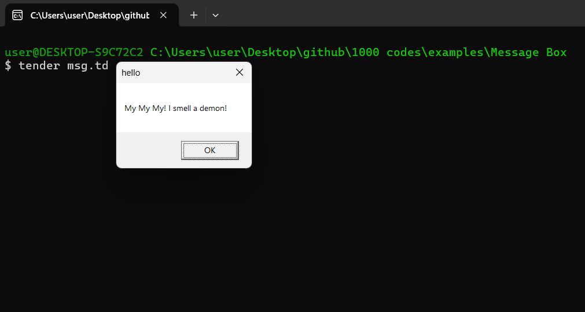

# Message Box Example in Tender

## Overview

This repository contains a simple script, `msg.td`, that demonstrates how to create a message box in the [**Tender**](https://github.com/2dprototype/tender). This script uses the `messagebox` module to display a custom message to the user.

## Preview



## Script

### `msg.td`

This script opens a message box displaying the message "My My My! I smell a demon!" with a title of "hello." It uses the `messagebox.MB_DEFBUTTON4` to specify the button configuration.

**Code Example:**
```tender
//[!config] MaxStringLen=2147483647;MaxBytesLen=2147483647;Version=v0.0.1

import "messagebox"

messagebox.new("My My My! I smell a demon!", "hello", messagebox.MB_DEFBUTTON4)
```

**Functionality:**
- Displays a message box with a custom message and title.
- Configures the message box to use a specific button layout.

## Usage

- To run the script, use the following command in your terminal:
    ```bash
    tender msg.td
    ```
- Observe the message box that appears with the specified message and title.

## Explore More

This script is part of the larger collection of examples in the 1000+ Codes in Tender repository. Feel free to explore and modify the code to enhance your understanding of creating interactive elements with Tender!

## License

This project is open-source. Feel free to contribute or use it in your own projects.
