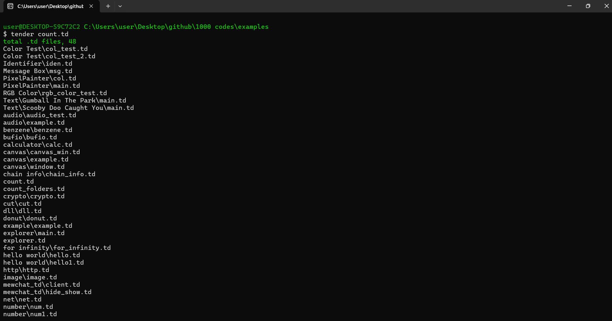

# 1000+ Codes in Tender

Welcome to **1000+ Codes in Tender**! This project is a comprehensive collection of code snippets and examples designed to help developers learn and utilize the Tender effectively. Whether you are a beginner or an experienced developer, you will find a variety of practical examples and tutorials that cover a wide range of functionalities in [**Tender**](https://github.com/2dprototype/tender).

## Table of Contents
- [Introduction](#introduction)
- [Installation](#installation)
- [Usage](#usage)
- [Project Structure](#project-structure)
- [Included Scripts](#included-scripts)
- [Contributing](#contributing)
- [License](#license)
- [Acknowledgments](#acknowledgments)

## Introduction

Tender is a general-purpose programming language optimized for image processing, 2D graphics, and scripting. This repository contains over 1000 code snippets demonstrating various features and libraries within Tender, making it an excellent resource for learning and experimentation.

## Installation

To get started with Tender, follow these steps:

1. **Install Go**: Ensure you have the latest version of Go installed on your machine. You can download it from [golang.org](https://golang.org/dl/).

2. **Install Tender**: Use the following command to install Tender:
   ```bash
   go install github.com/2dprototype/tender/cmd/tender@latest
   ```

   Alternatively, you can download precompiled binaries from the [Tender Releases](https://github.com/2dprototype/tender/releases) page. Choose the appropriate binary for your operating system and follow the installation instructions provided there.

3. **Clone the Repository**:
   ```bash
   git clone https://github.com/IHEfty/1000-codes-in-tender.git
   cd 1000-codes-in-tender
   ```

## Usage

After cloning the repository, you can run any of the example codes provided:

1. Navigate to the example directory:
   ```bash
   cd examples folder
   ```

2. Run a specific Tender script:
   ```bash
   tender example_script.td
   ```

Feel free to explore the various code snippets and modify them as needed to fit your projects.

## Project Structure

The project is organized as follows:

```
examples
├── benzene
│   ├── benzene.td
│   └── ...
├── ...
└── count.td
```

- **examples/**: Contains various Tender scripts demonstrating different functionalities.
- **README.md**: This documentation file.
- **LICENSE**: The license for this project.

## Included Scripts

### `count.td`

The `count.td` script counts the total number of `.td` files in the current directory and its subdirectories. It provides a simple way to track how many Tender scripts you have, which can be useful for project organization or inventory purposes.

## Preview



**How It Works**:
1. **Walks the Directory**: The script uses the `path.walklist` function to retrieve a list of files in the current directory.
2. **Counts `.td` Files**: It iterates through the list and checks each file's extension. If the extension is `.td`, it increments a counter and adds the file to a list.
3. **Outputs Results**: Finally, it prints the total count of `.td` files and lists them.

**To Run `count.td`**:
```bash
tender count.td
```

## Contributing

Contributions are welcome! If you have code snippets or examples that you would like to share, please follow these steps:

1. Fork the repository.
2. Create a new branch (`git checkout -b feature/YourFeature`).
3. Make your changes and commit them (`git commit -m 'Add some feature'`).
4. Push to the branch (`git push origin feature/YourFeature`).
5. Open a Pull Request.

## License

This project is open-source. Feel free to contribute or use it in your own projects.

## Acknowledgments

A special thanks to the creators of Tender and all contributors to the Tender community. Your hard work and dedication make this project possible!
