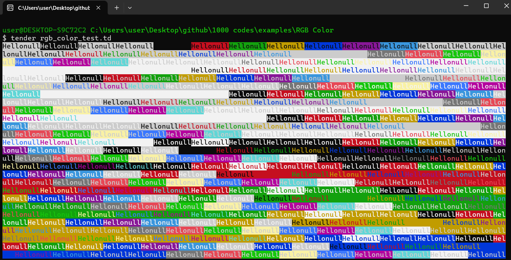

# RGB Color Test Examples in Tender

## Overview

The `rgb_color_test.td` script demonstrates how to generate RGB color combinations using the [**Tender**](https://github.com/2dprototype/tender). This example is part of the larger **1000+ Codes in Tender** repository, showcasing various coding techniques and functionalities.

## Preview

## Features

- **RGB Color Generation**: The script iterates through a predefined range of RGB values and outputs colored text to the terminal.
- **File Output**: Each generated colored string is appended to a text file (`out.txt`), allowing for easy review of all color combinations.
- **Endless Loop**: The script runs indefinitely after generating the colors, ensuring continuous output if desired.

## Usage

1. **Run the Script**: Use the command `tender rgb_color_test.td` to execute the script.
2. **View Output**: The script will display colored "Hello" messages in the terminal. Check `out.txt` for the same messages saved to a file.
