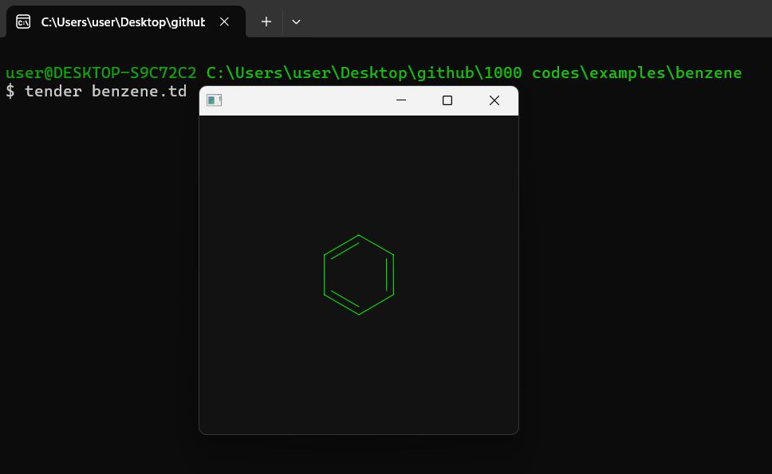

# Benzene Drawing Example in Tender

## Overview

This repository contains a script, `benzene.td`, that demonstrates the drawing of a benzene ring using the [**Tender**](https://github.com/2dprototype/tender). The script utilizes the canvas module to create a visual representation of a benzene structure by drawing hexagons with customizable parameters.

## Preview



## Script

### `benzene.td`

- **Functionality**: This script draws a benzene ring by creating a hexagonal shape with alternating lines. It allows customization of the radius and which lines to draw.
- **Output**: A graphical representation of a benzene ring displayed in a window.

**Code Example**:

```tender
import "canvas"  // Import the canvas module
import "math"  // Import the math module

w := 600
h := 400

fn benzene(ctx, x, y, radius, m, n) {
	ctx.push()
	ctx.translate(x, y)
	ctx.rotate(math.pi/2)
	a := 0.333 
	for i := 0; i < 6; i++ {
		ctx.move_to(radius * math.cos(i * math.pi * a), radius * math.sin(i * math.pi * a))
		ctx.line_to(radius * math.cos((i+1) * math.pi * a), radius * math.sin((i+1) * math.pi * a))
	}
	radius -= 10
	for i := 0; i < 6; i++ {
		if i % m != n {
			continue
		}
		ctx.move_to(radius * math.cos(i * math.pi * a), radius * math.sin(i * math.pi * a))
		ctx.line_to(radius * math.cos((i+1) * math.pi * a), radius * math.sin((i+1) * math.pi * a))
	}
	ctx.stroke()	
	ctx.pop()
}

fn draw(ctx) {
	x := 200
	y := 200
	r := 50
	a := r * math.sqrt(3) / 2
	ctx.linewidth(1)
	ctx.hex(`#121212`)
	ctx.clear()
	ctx.hex("#0f0")
	benzene(ctx, x, y, r, 2, 0)
	// benzene(ctx, x, y, r, 1, 1)
	// benzene(ctx, x-a, y+r*1.5, r, 2, 0)
	// benzene(ctx, x+a, y+r*1.5, r, 1, 1)
}

opts := {
	width: 400,
	height: 400
}

canvas.new_window(opts, fn(window){
	ctx := window.new_context(w, h)
	draw(ctx)
	window.update(w, h)
	for {
		e := window.next_event()
		if e.type == "size" {
			w = e.width_px 
			h = e.height_px
			ctx = window.new_context(e.width_px, e.height_px)
			draw(ctx)
			window.update(w, h)
		}
		else if e.type == "lifecycle" && e.from == 3 && e.to == 0 {
			break
		}
	}
})
```

## Usage

1. **Run the Script**: Use the command `tender benzene.td` to execute the script.
2. **View Output**: A window will open displaying the benzene structure drawn according to the parameters set in the code.

## Explore More

This project is one of many examples in the [**1000+ Codes in Tender**](https://github.com/IHEfty/1000-Codes-in-Tender/) repository. Feel free to explore and modify the code to enhance your understanding of graphical drawing with Tender!

## License

This project is open-source. Feel free to contribute or use it in your own projects.
