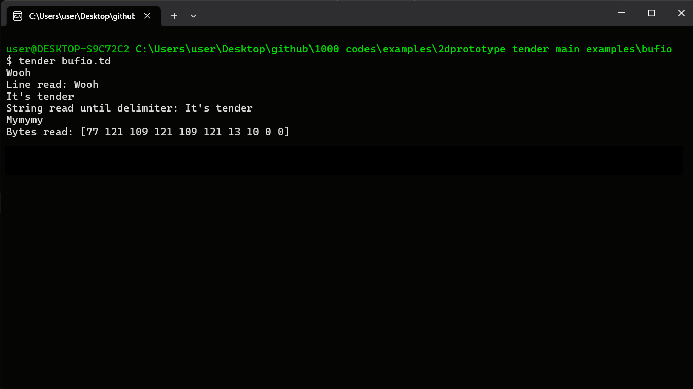

# Buffered I/O (bufio) Example in Tender

This project demonstrates how to use the **Buffered I/O** (`bufio`) module in **Tender** for efficient input handling.



## Overview

The **bufio.td** script showcases three methods for reading input:
1. **Reading a Line**: Reads input until a newline.
2. **Reading a String**: Reads input until a specified delimiter.
3. **Reading Bytes**: Reads a specified number of bytes.

## Running the Project

Run the script in your terminal:

```bash
tender bufio.td
```

It will process the input based on the method used.

## License

This is an open-source project. Contribute or use it freely.
