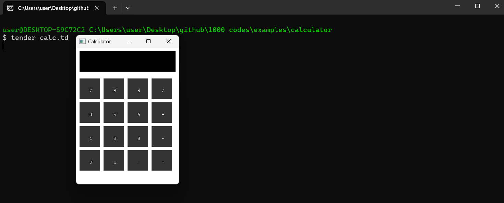

# Calculator Template

The **Calculator Template** is part of the **1000+ Codes in Tender** collection. Written in [**Tender**](https://github.com/2dprototype/tender), this project provides a graphical interface for a basic calculator, but the calculation logic is not implemented yet. It's designed as a starting point for further development.

## Preview



## Running the Project

Execute the `calc.td` script to launch the calculator interface:

```bash
tender calc.td
```

## How It Works

The script creates a window with a set of buttons and an input display. The layout and button interactions are defined, but the calculation logic needs to be added. You can implement the arithmetic functionality in the `calculate()` function, parsing the input string for operations.

## Customizing the Calculator

You can extend the functionality by adding features like a clear button (`C`), error handling, and more complex operations.

## Project Structure

- **calc.td**: Main script defining the interface and logic.

Explore, modify, and build upon this template to create your own functional calculator in **Tender**!
