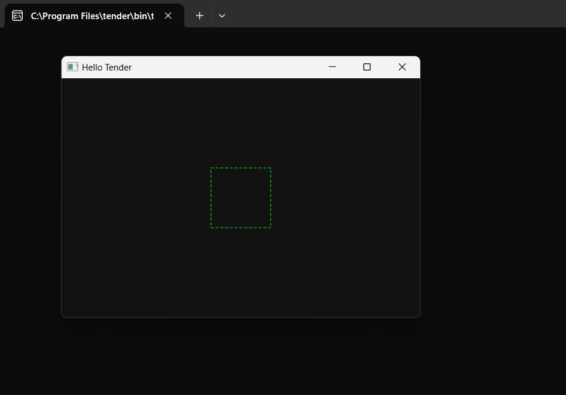
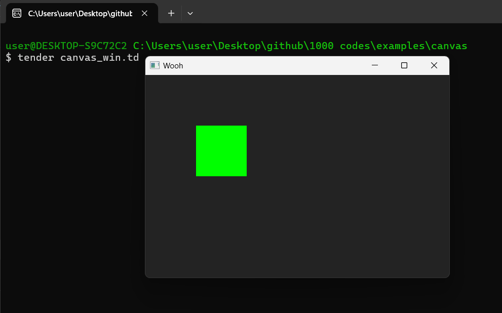
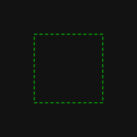

# Canvas Window & Window Resizing Project

The **Canvas Window & Window Resizing Project** is part of the **1000+ Codes in Tender** collection. This project, written in the [**Tender**](https://github.com/2dprototype/tender), demonstrates how to create a dynamic window with a drawing canvas and render basic graphics. It also showcases how to handle window resizing events and adapt the drawing to the new window dimensions.



## Overview

This project consists of two main scripts:
- **canvas_win.td**: A basic canvas rendering script that creates a simple window and draws a green rectangle.
- **window.td**: An advanced window management script that handles window resizing and redraws the shapes based on the new dimensions.

In both examples, a dark background with a green rectangle is displayed, and the shapes adapt to changes in the window size.

## Running the Project

To run either of the scripts, use the following commands:

### For `canvas_win.td`:
```bash
tender canvas_win.td
```

### For `window.td`:
```bash
tender window.td
```

Both commands will open a window with a canvas where a simple green rectangle is rendered. The `window.td` script handles resizing dynamically.

### Preview of Running Window

The output for both scripts looks like this:



## Customizing the Drawing

You can modify the drawing in both scripts by changing the parameters in the `draw` function. For example, in `window.td`, you can adjust the rectangle’s position, size, or color by modifying these lines:

```tender
ctx.rect(w/2-50, h/2-50, 100, 100) // Adjust position and size
ctx.hex("#0f0") // Change color using hex codes
```

### `canvas_win.td` Structure

- **Draw Logic**: It creates a simple window of 600x400 pixels with a green rectangle centered on a dark background.
- **Basic Event Loop**: No advanced events are handled in this file, it simply renders the initial shapes.

### `window.td` Structure

- **Dynamic Resizing**: This script monitors window resize events and redraws the shapes based on the new window size, ensuring the drawing stays centered.
- **Draw Function**: Contains the logic for clearing the canvas, setting colors, and drawing shapes.
- **Window Lifecycle**: Manages window events and closes the window gracefully when needed.

## Code Breakdown

- **Imports**: Both scripts import the `canvas` module for managing graphics. `window.td` also includes lifecycle event handling.
- **Event Handling**: `window.td` handles events like window resizing to make sure the canvas adapts to the new size.
- **Drawing Logic**: The drawing function ensures that the shapes are drawn based on the current window size, dynamically resizing them when the window is adjusted.

### Example Image Output

The `example.td` script (part of this project) generates the following image and saves it as `output.png`:



## License

This project is open-source. Feel free to contribute or use it in your own projects.

## Explore More

The **Canvas Window & Window Resizing Project** is just one of many examples in the **1000+ Codes in Tender** repository. Feel free to explore and modify the code to enhance your understanding of graphics programming and window management with Tender!
