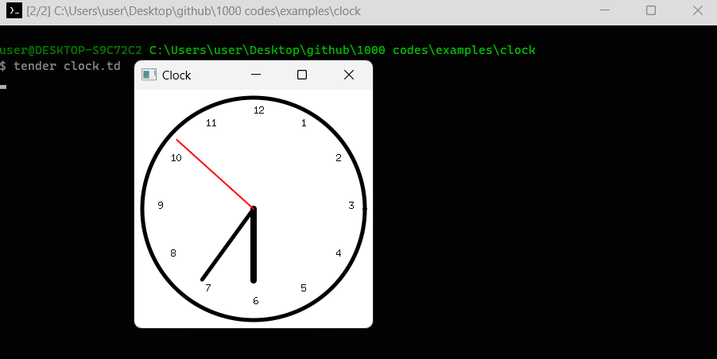

# Clock in Tender

This script creates an analog clock in the **Tender** programming language, utilizing the `canvas`, `times`, and `math` modules. The clock displays a real-time representation of hours, minutes, and seconds, with a dynamically updating interface in a window.

## Preview



## Features

- **Analog Clock Face**: Includes hour markings and a circular clock face.
- **Real-Time Updates**: Uses current system time to update the clock hands every second.
- **Customizable Design**: Modify colors, hand lengths, and line widths to fit design preferences.
- **Smooth Drawing**: Uses helper functions to ensure smooth drawing and animation of clock hands.

### Code Walkthrough

1. **Clock Initialization**:
   - Creates a 300x300-pixel canvas window named "Clock" to host the analog clock.
   
2. **Hand Drawing Functionality**:
   - `draw_hand(ctx, angle, length)`: Draws each clock hand based on specified angles (hours, minutes, seconds).

3. **Hour Marking**:
   - `draw_numbers(ctx)`: Draws the hour numbers on the clock face, positioned based on their angle in a circle.

4. **Clock Hand Angles**:
   - Computes hour, minute, and second angles based on the current time.
   
5. **Time Update Loop**:
   - Refreshes the clock display every second using `times.sleep(times.second)` to synchronize with real-time.

### Example Output

The script draws a white clock face with a black border, black hour and minute hands, and a red second hand that updates every second.

## Installation & Usage

1. **Prerequisites**: Install the **Tender** programming language. (Refer to the [Tender GitHub Repository](https://github.com/2dprototype/tender) for installation instructions).
2. **Save the Script**: Copy the code and save it as `clock.td`.
3. **Run the Script**:
   - To start the clock, use the following command:

     ```bash
     tender clock.td
     ```

## Example Code

Here’s the core script for creating the clock in Tender:

```tender
import "canvas"
import "times"
import "math"

w := 300
h := 300

fn draw_hand(ctx, angle, length) {
	x := w/2 + length * math.cos(angle)
	y := h/2 + length * math.sin(angle)
	ctx.move_to(w/2, h/2)
	ctx.line_to(x, y)
	ctx.stroke()
}

fn draw_numbers(ctx) {
	ctx.hex("#000")
	for i := 1; i <= 12; i++ {
		angle := -math.pi/2 + (2 * math.pi * i) / 12
		x := w/2 + (w/2 - 30) * math.cos(angle)
		y := h/2 + (h/2 - 30) * math.sin(angle)
		ctx.text(i, x, y)
	}
}

fn draw_clock(ctx) {
	ctx.hex(`#ffffff`)
	ctx.clear()
	ctx.hex("#000")
	ctx.linewidth(5)
	ctx.circle(w/2, h/2, w/2 - 10)
	ctx.stroke()
	draw_numbers(ctx)

	now := times.now()
	hour := times.time_hour(now) % 12
	minute := times.time_minute(now)
	second := times.time_second(now)

	second_angle := -math.pi/2 + (2 * math.pi * second) / 60
	minute_angle := -math.pi/2 + (2 * math.pi * minute) / 60
	hour_angle := -math.pi/2 + (2 * math.pi * (hour + minute / 60)) / 12

	ctx.hex("#000")
	ctx.linewidth(8)
	draw_hand(ctx, hour_angle, w/2 - 60)
	ctx.linewidth(5)
	draw_hand(ctx, minute_angle, w/2 - 40)
	ctx.hex("#f00")
	ctx.linewidth(2)
	draw_hand(ctx, second_angle, w/2 - 20)
}

canvas.new_window(w, h, "Clock", fn(window) {
	ctx := window.new_context(w, h)

	ro := go(fn(){
		for {
			draw_clock(ctx)
			window.update(w, h)
			times.sleep(times.second)
		}
	})

	for {
		e := window.next_event()
		if e.type == "lifecycle" && e.from == 3 && e.to == 0 {
			ro.abort()
			break
		}
	}
})
```

## Customization

To modify the appearance or functionality of the clock, consider adjusting:

- **Colors**: Change `ctx.hex()` values for different hand and background colors.
- **Hand Lengths**: Modify `w/2 - 60`, `w/2 - 40`, and `w/2 - 20` for hour, minute, and second hand lengths.
- **Font and Line Widths**: Use different font styles or line widths to personalize the look.

## Explore More

This project is part of the **1000+ Codes in Tender** repository. Feel free to explore and modify the code to enhance your understanding of blockchain data processing with Tender! Visit the [Tender GitHub Repository](https://github.com/2dprototype/tender) for more examples and projects.

## License

This project is open-source and can be modified or used in personal projects.

