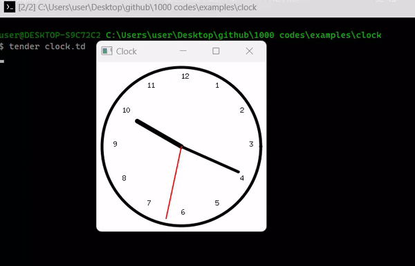

# Analog Clock in Tender

This script creates an analog clock using the **Tender** programming language. The clock displays real-time hours, minutes, and seconds, with dynamically updating hands in a window.



## Features

- **Analog Clock Face** with hour markings.
- **Real-Time Updates** synced to system time.
- **Customizable Design** for colors and hand lengths.
- **Smooth Animation** with real-time updates every second.

## How It Works

1. **Canvas Creation**: A 300x300 canvas window is used to draw the clock face.
2. **Clock Hands**: Draws the hour, minute, and second hands based on real-time angles.
3. **Time Synchronization**: The clock updates every second using `times.sleep(times.second)` to reflect the system's time.
4. **Markings**: Hour numbers are placed around the clock based on angles.

## Usage

1. **Install Tender** from [Tender GitHub Repository](https://github.com/2dprototype/tender).
2. Save the script as `clock.td`.
3. Run with:

   ```bash
   tender clock.td
   ```

## Customization

- Modify **colors** with `ctx.hex()`.
- Adjust **hand lengths** for hour, minute, and second.
- Change **font styles** or **line widths** for personal preference.

## License

This project is open-source. Feel free to modify or use it in personal projects.
