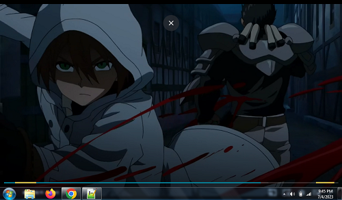
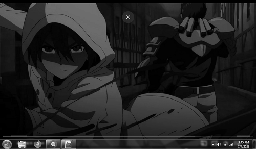

# Grayscale Image Converter in Tender

This project demonstrates how to convert a colored image to grayscale using the **Tender** programming language. The script utilizes the `image` module to load an image, process its pixel data, and save the modified image as a grayscale version.

## `input`

 

## `output`

 


- **Input Image (`img.png`)**: The original colored image used for conversion.
- **Output Image (`out.png`)**: The resulting grayscale image after processing.

## File Structure

```
cng col
├── grayscale.td   # Grayscale conversion script
├── img.png        # Original colored image
└── out.png        # Grayscale image output
```
