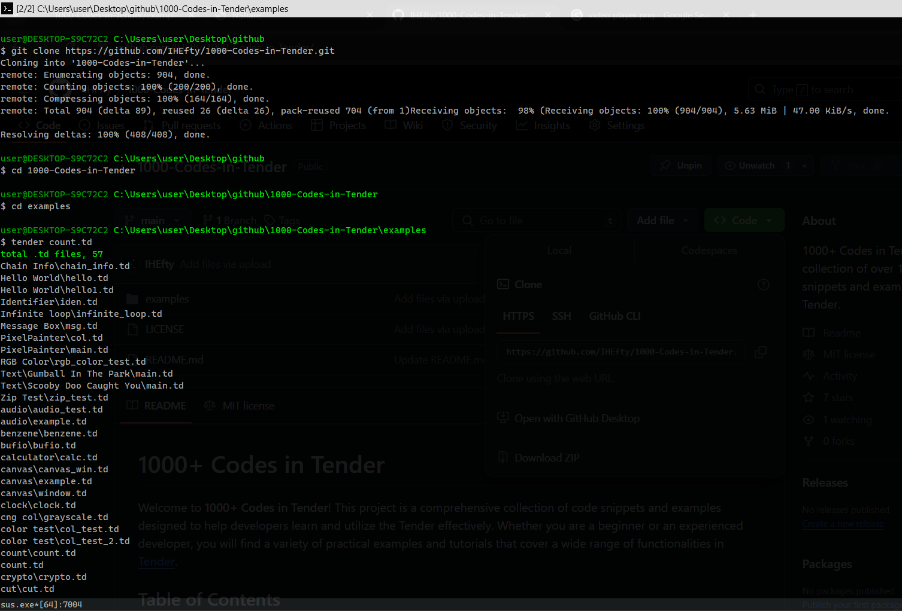

### `count.td`

The `count.td` script counts the total number of `.td` files in the current directory and its subdirectories. It provides a simple way to track how many Tender scripts you have, which can be useful for project organization or inventory purposes.

## Preview



**How It Works**:
1. **Walks the Directory**: The script uses the `path.walklist` function to retrieve a list of files in the current directory.
2. **Counts `.td` Files**: It iterates through the list and checks each file's extension. If the extension is `.td`, it increments a counter and adds the file to a list.
3. **Outputs Results**: Finally, it prints the total count of `.td` files and lists them.

**To Run `count.td`**:
```bash
tender count.td
```

## Contributing

Contributions are welcome! If you have code snippets or examples that you would like to share, please follow these steps:

1. Fork the repository.
2. Create a new branch (`git checkout -b feature/YourFeature`).
3. Make your changes and commit them (`git commit -m 'Add some feature'`).
4. Push to the branch (`git push origin feature/YourFeature`).
5. Open a Pull Request.

## License

This project is open-source. Feel free to contribute or use it in your own projects.

## Explore More

This project is one of many examples in the [**1000+ Codes in Tender**](https://github.com/IHEfty/1000-Codes-in-Tender/) repository. Feel free to explore and modify the code to enhance your understanding of color manipulation and formatting with Tender!

## Acknowledgments

A special thanks to the creators of Tender and all contributors to the Tender community. Your hard work and dedication make this project possible!
