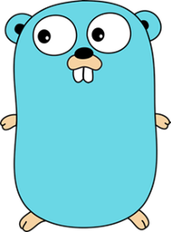
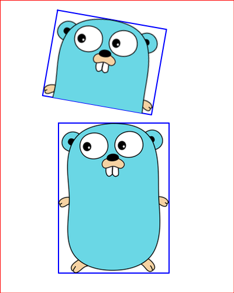

# Cut

The **Cut** project is part of the **1000+ Codes in Tender** collection. This project, written in the [**Tender**](https://github.com/2dprototype/tender), demonstrates how to manipulate and draw images on a canvas.

## Running the Project

To run the Cut project, execute the `cut.td` script:

```bash
tender cut.td
```

This will load the image `gopher.png` and create an output image `out.png` with various drawings.

## `gopher.png`


## `out.png`

### Customizing the Image

To use a different image, replace `gopher.png` in the script with your desired image file name. Ensure that your image is located in the same directory as the script.

Example modification:

```tender
im := image.load("your_image.png")
```

## Project Structure

- **cut.td**: The main script that loads the image and performs drawing operations on the canvas.

## Explore More

The **Cut** project is one of many examples in the **1000+ Codes in Tender** repository. Feel free to explore and modify the code to enhance your understanding of image manipulation with Tender!
