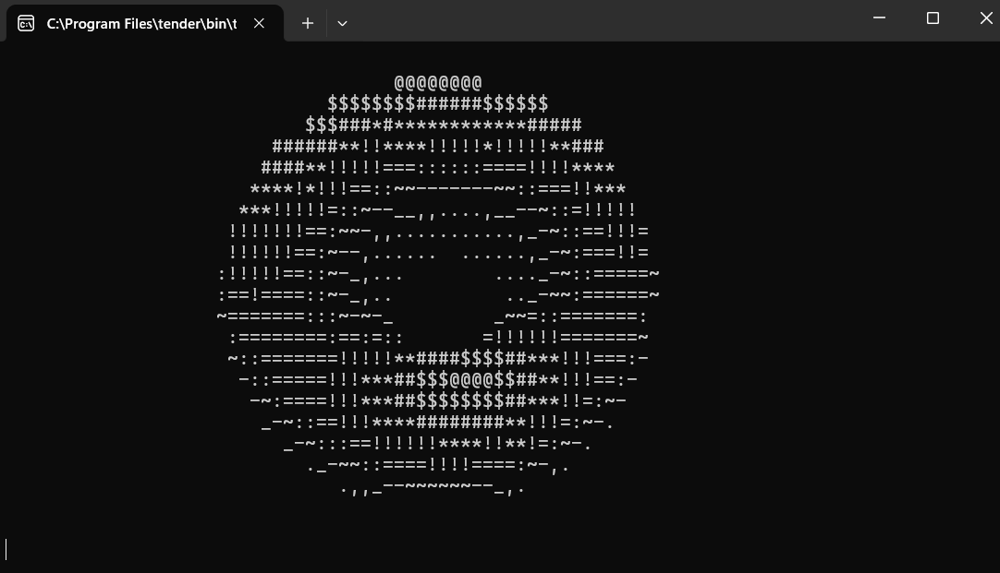

# Donut

The **Donut** project demonstrates creating a rotating 3D ASCII donut in the terminal using **Tender**. It uses mathematical functions to generate and continuously update the donut's shape, creating a rotation effect.

## How It Works

The program calculates the donut's shape using trigonometric functions, and displays it using ASCII characters. The rotation is achieved by incrementing values in the main loop that update the donut's position.

You can adjust the rotation speed by modifying the values of `A` and `B` in the main loop.

## Project Structure

- **donut.td**: Main script to generate the rotating ASCII donut.

