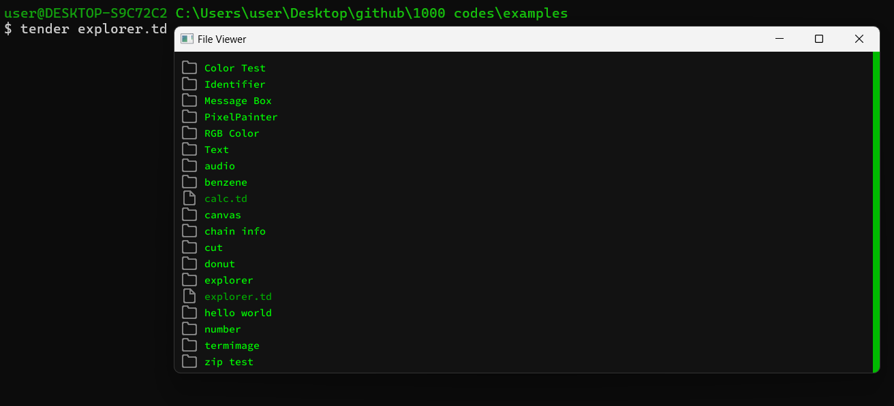

# Tender Explorer

**Tender Explorer** is part of the **1000 Codes Project**, showcasing various functional and creative code snippets using the [**Tender**](https://github.com/2dprototype/tender). This particular code is a simple yet interactive file explorer built with Tender. It enables users to navigate directories, view files, and explore their system's file structure using an intuitive interface.

## Table of Contents

- [Preview](#Preview)
- [Features](#features)
- [Installation](#installation)
- [Usage](#usage)
- [Keyboard and Mouse Controls](#keyboard-and-mouse-controls)
- [Code Explanation](#code-explanation)
- [Part of 1000 Codes Project](#part-of-1000-codes-project)
- [Explore More](#explore-more)
- [License](#license)

## Preview



## Features

- **Interactive File Browser**: The explorer displays files and directories with a scrollable view.
- **File and Folder Icons**: Files and directories are represented by visual icons for better clarity.
- **Scrolling**: Use the keyboard or mouse to scroll through the directory contents.
- **Directory Navigation**: Click on directories to navigate deeper into the file system.
- **Responsive UI**: Resizes and adapts to the current window size.
- **Scrollbar**: A functional scrollbar provides visual feedback for the current scroll position.

## Installation

1. Clone or download this repository.
2. Make sure you have the **Tender** programming language installed. You can find more details in the [Tender Language Repository](https://github.com/2dprototype/tender).
3. Run the `tender explorer.td` script from your terminal.

## Usage

1. Launch the Tender Explorer by running the following command in your terminal:

   ```bash
   tender main.td
   ```

2. The file explorer will open in a window showing the current directory contents.

## Keyboard and Mouse Controls

- **Scroll Down**: `Down Arrow (↓)` or scroll wheel.
- **Scroll Up**: `Up Arrow (↑)` or scroll wheel.
- **Navigate into a Folder**: Click on a folder icon or its name.
- **Go Back to Parent Directory**: Press the `*` key.

## Code Explanation

This script builds a file explorer in **Tender** using the `canvas` and `fs` modules to handle graphical rendering and file system interaction. Here are some key parts of the code:

- **Canvas Drawing**: It uses the canvas to draw text, images (file and folder icons), and other UI components.
- **File Listing**: The explorer reads directory contents using `fs.readdir()` and displays the list of files and folders.
- **Scroll Handling**: Tracks the scroll position with `scroll_offset`, adjusting the visible items as users scroll.
- **Directory Navigation**: Clicking on a directory updates the current working directory and redraws the file list.

## Part of 1000 Codes Project

This code is part of the **1000 Codes Project**, a collection of interesting and functional code snippets showcasing the power of the Tender language. Each snippet focuses on solving a particular problem or demonstrating a unique feature of the language.

## Explore More

This project is part of the **1000+ Codes in Tender** repository. Feel free to explore and modify the code to enhance your understanding of blockchain data processing with Tender! Visit the [Tender GitHub Repository](https://github.com/2dprototype/tender) for more examples and projects.

## License

This project is open-source. Feel free to contribute or use it in your own projects. 
