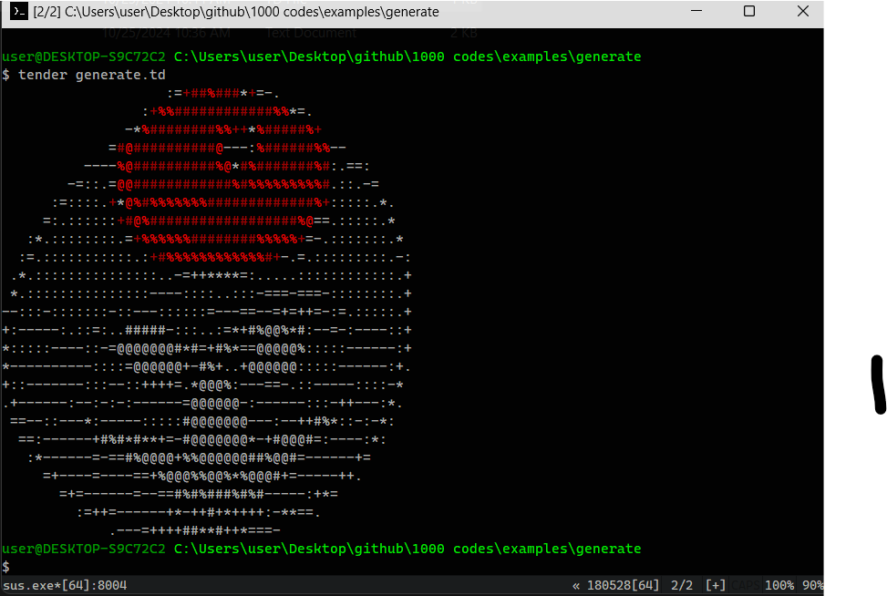

# Text Color Generator Project in Tender

This project showcases how to create a color-coded text output using the **Tender** programming language. The script reads a text file (`hi.txt`) and applies different colors to specific characters based on predefined conditions.

## Preview



## Features

- Reads a text file containing characters and applies color formatting.
- Colors are applied based on character types:
  - Red for `#` and `+`
  - Intense red for `%` and `@`
  - White for all other characters
- Outputs the formatted text to the console, limiting the number of lines to 10 for color formatting.

## Prerequisites

- Ensure you have the **Tender** programming language installed. For installation instructions, visit the [Tender GitHub Repository](https://github.com/2dprototype/tender).

## Installation

1. Clone this repository or download the project files.
2. Ensure you have the `hi.txt` file in the same directory as the script.

## Usage

Run the script using the following command:

```bash
tender generate.td
```

## Code Overview

### File Structure

```
generate
├── generate.td    # Script for generating colored text
└── hi.txt         # Text file containing characters for formatting
```

### Text Generation Logic

1. **Imports**:
   The script imports necessary modules for file operations, string manipulations, and color handling.

   ```tender
   os := import("os")
   strings := import("strings")
   color := import("color")
   ```

2. **Reading the Text File**:
   The script reads the `hi.txt` file and splits its contents into an array of characters.

   ```tender
   file := os.read_file("hi.txt")
   arr := strings.split(string(file), "")
   ```

3. **Color Formatting**:
   The script initializes a variable to count the number of lines processed (`n`) and an output string (`out`). It iterates through each character in the text array, applying color formatting based on specific conditions.

   - If the character is `#` or `+`, it adds a red color.
   - If the character is `%` or `@`, it adds an intense red color.
   - Any other character is colored white.

   The color formatting is only applied for the first 10 lines. After that, all characters are colored white.

   ```tender
   for a in arr {
       if a == "\n" {
           n++
       }

       if n < 10 {
           if a == "#" || a == "+" {
               out += color.red + a
           } else if a == "%" || a == "@" {
               out += color.ired + a
           } else {
               out += color.white + a
           }
       } else {
           out += color.white + a
       }
   }
   ```

4. **Output**:
   Finally, the script resets the color and outputs the formatted text to the console.

   ```tender
   out += color.reset
   sysout out
   ```

## Example Output

After running the script, you will see the output in the console with color-coded characters based on the conditions specified in the script.

## Explore More

This project is part of the **1000 Codes Project** in **Tender**, which features a collection of interesting and functional code snippets. Visit the [Tender GitHub Repository](https://github.com/2dprototype/tender) for more examples and projects.

## License

This project is open-source. Feel free to contribute or use it in your own projects.
