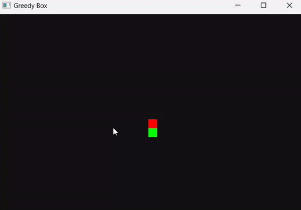

# Greedy Box Game

**Greedy Box** is a simple game developed in the **Tender** programming language that represents the concept of greed—constantly consuming without growth. The game features a box that eats food while moving until it collides with a boundary or itself.

## Features

- **Random Food Generation**: Food items appear randomly on the canvas.
- **Dynamic Movement**: Control the box's direction using keyboard inputs.
- **Game Over**: The game ends if the box hits the boundary or collides with itself.

## How It Works

- The box continuously moves in the specified direction, eating food when it contacts it. Each time food is eaten, it respawns at a random location.
- The game ends if the box hits the boundary or collides with itself, symbolizing the destructive nature of unchecked greed.

## Game Preview



## Usage

1. Ensure **Tender** is installed.
2. Save as `greedy_box.td`.
3. Run with:

```bash
tender greedy_box.td
```

Use arrow keys to control the box.
