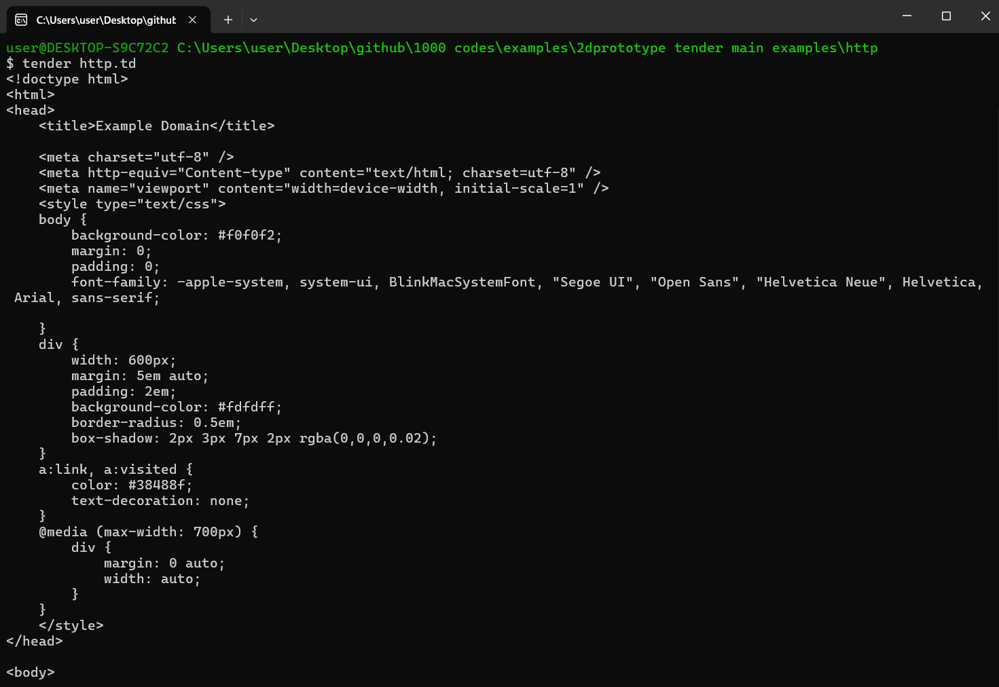

# HTTP Request Example in Tender

This project demonstrates how to make a basic HTTP GET request using the **http** module in the **Tender** programming language. The script fetches the content from a specified URL and prints the response.

## Preview



## Files Included

- **http.td**: The main script that makes an HTTP GET request and displays the result.

## Overview

The **http.td** script showcases how to use the `http.get()` function to send a GET request to a website and handle the response. In this example, the request is sent to `https://example.com`, and the resulting HTML content of the webpage is displayed.

## Running the Project

To run the project, execute the `http.td` script in your terminal:

```bash
tender http.td
```

The script will perform an HTTP GET request to `https://example.com` and display the HTML content of the page in the terminal.

### Example Output

When running the script, you should see the HTML content of the page:

```bash
<!doctype html>
<html>
<head>
    <title>Example Domain</title>
    <meta charset="utf-8" />
    <meta name="viewport" content="width=device-width, initial-scale=1" />
    <style type="text/css">
        body {
            background-color: #f0f0f2;
            margin: 0;
            padding: 0;
        }
        /* ...more HTML content... */
    </style>
</head>
<body>
    <div>
        <h1>Example Domain</h1>
        <p>This domain is for use in illustrative examples in documents...</p>
    </div>
</body>
</html>
```

## Project Structure

- **http.td**:
  - Uses the `http.get()` function to perform a GET request.
  - Checks if the response contains an error using the `is_error()` function.
  - Prints the response content if successful, or prints the error response if there is an issue.

### Code Breakdown

```tender
import "http"

// GET request to fetch the content from the specified URL
response := http.get("https://example.com")

// Check if the request was successful
if !is_error(response) {
    println(string(response))  // Print the HTML content of the page
} 
else {
    println("Response: ", response)  // Print the error response
}
```

### How It Works

1. **http.get(url)**: Sends a GET request to the specified URL (in this case, `https://example.com`) and retrieves the response.
2. **is_error(response)**: Checks if the response contains an error.
3. If the request is successful, the HTML content of the webpage is printed to the console.
4. If the request fails, the error response is printed.

## Customizing the URL

You can modify the URL in the script to fetch content from other websites. Simply replace the URL in the `http.get()` function:

```tender
response := http.get("https://another-website.com")
```

## License

This project is open-source. Feel free to contribute or use it in your own projects.

## Explore More

The **HTTP Example** is part of the **1000+ Codes in Tender** collection. Visit the [Tender GitHub Repository](https://github.com/2dprototype/tender) for more examples and projects.
