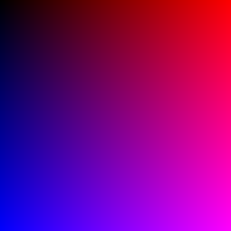

# Image Creation Example in Tender

This project demonstrates how to create and manipulate images using the **image** module in the [**Tender**](https://github.com/2dprototype/tender). The script generates an image with pixel color gradients and saves it as a PNG file.

## Files Included

- **image.td**: The main script that creates and saves a 255x255 pixel image.

## Overview

The **image.td** script showcases how to create an image using the `image.new()` function, set pixel colors using the `set()` method, and save the image in PNG format. In this example, each pixel's color is determined by a simple gradient based on its position in the image.

## Running the Project

To run the project, execute the `image.td` script:

```bash
tender image.td
```

After running the script, an image file named `out.png` will be generated in the same directory. The image will be a 255x255 pixel gradient where the red and blue components of the color change based on the pixel's position.

### Example Output
## out.png



The script generates an image (`out.png`) with a gradient where the red and blue components change across the width and height of the image.

## Project Structure

- **image.td**:
  - Creates a new 255x255 pixel image.
  - Fills the image with a color gradient based on pixel positions.
  - Saves the image as a PNG file.

### Code Breakdown

```tender
import "image"

// Create a new image with dimensions 255x255
img := image.new(255, 255)

// Loop through each pixel and set the color
for i := 0; i < 255; i++ {
	for j := 0; j < 255; j++ {
		color := [i, 0, j, 255]  // Red and Blue gradient
		img.set(i, j, color)     // Set pixel color at position (i, j)
	}
}

// Save the image as a PNG file
img.save("out.png", "png")
```

### How It Works

1. **image.new(width, height)**: Creates a new image with the specified dimensions (255x255 pixels in this case).
2. **img.set(x, y, color)**: Sets the color of the pixel at position `(x, y)`. The `color` is an array representing the RGBA color components: `[Red, Green, Blue, Alpha]`.
3. **img.save("filename", "format")**: Saves the image as a file in the specified format (PNG in this case).

### Customizing the Image

You can modify the image dimensions, colors, and patterns by adjusting the following parameters:

- **Image Dimensions**: Change the size of the image by modifying the `image.new(width, height)` function.
  
```tender
img := image.new(500, 500)  // Creates a 500x500 image
```

- **Pixel Colors**: Adjust the color array to change the color pattern. For example, you can modify the green component to create different color combinations.

```tender
color := [i, j, 0, 255]  // Red and Green gradient instead of Red and Blue
```

## License

This project is open-source. Feel free to contribute or use it in your own projects.

## Explore More

The **Image Creation Example** is part of the **1000+ Codes in Tender** collection. Visit the [Tender GitHub Repository](https://github.com/2dprototype/tender) for more examples and projects.
