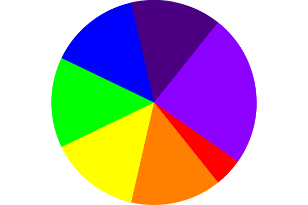

# Pi Arc Drawing Project in Tender

This project generates a colorful pie chart-like image with segments inspired by π (pi). It creates an image with N segments, each filled with a different color, and saves it as `pi_arc.png`.

## Features

- Draws a pie chart with N segments, each filled with a different color.
- Saves the rendered image as a PNG file (`pi_arc.png`).

## How It Works

1. **Canvas Initialization**: A canvas of 600x400 pixels is created.
2. **Arcs Drawing**: The script calculates the center and radius, then draws N arcs with different colors.
3. **Output**: The resulting image is saved as `pi_arc.png`.

## Output

