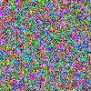

# Random Color Canvas Project in Tender

This project generates a 255x255 pixel canvas where each pixel is filled with a randomly generated RGB color, saving the result as a PNG image (`rand.png`).

## Features

- Creates a 255x255 canvas.
- Fills each pixel with a random RGB color.
- Saves the output as `rand.png`.

## How It Works

The script initializes a canvas and iterates over each pixel. For every pixel, it generates random RGB values (ranging from 0 to 1) and assigns them to the pixel. After the canvas is filled, it is saved as a PNG image.

## Installation & Usage

1. Clone/download the project.
2. Run the script using:

   ```bash
   tender rand.td
   ```

## Output



This generates an image with a canvas of random colors.
