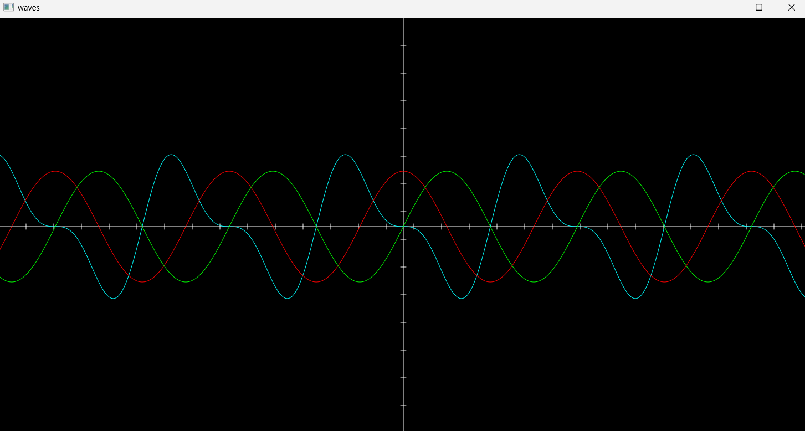

# Wave Drawing in Tender

This project showcases how to create dynamic wave visualizations using the **Tender** programming language. The script utilizes the `canvas` and `math` modules to render sine and cosine waves in a graphical window.

## Preview



## Features

- Visual representation of sine and cosine waves.
- Customizable parameters for amplitude, frequency, and colors.
- Supports window resizing, updating the canvas in real-time.

## Prerequisites

- Ensure you have the **Tender** programming language installed. For installation instructions, visit the [Tender GitHub Repository](https://github.com/2dprototype/tender).

## Installation

1. Clone this repository or download the script.
2. Save the code in a file named `wave_visualizer.td`.

## Usage

Run the script using the following command:

```bash
tender wave_visualizer.td
```

## Code Overview

### Parameters

- **`w`**: Canvas width (default: 600).
- **`h`**: Canvas height (default: 400).
- **`amplitude`**: Controls the height of the waves (default: 100).
- **`frequency`**: Affects the wavelength of the waves (default: 0.02).

### Main Functions

1. **Drawing Axes**:
   The `draw_axes` function draws the X and Y axes on the canvas, including tick marks.

   ```tender
   fn draw_axes(ctx) {
       ctx.hex("#ffffff")  // Set axis color to white
       ctx.linewidth(1)

       // Draw X-axis
       ctx.move_to(0, h / 2)
       ctx.line_to(w, h / 2)
       ctx.stroke()

       // Draw Y-axis
       ctx.move_to(w / 2, 0)
       ctx.line_to(w / 2, h)
       ctx.stroke()

       // Draw tick marks
       for i := 0; i < w; i += 50 {
           ctx.move_to(i, h / 2 - 5)
           ctx.line_to(i, h / 2 + 5)
           ctx.stroke()
       }
   }
   ```

2. **Drawing Functions**:
   The `draw_func` function is responsible for plotting a mathematical function on the canvas. It takes the color and the function as arguments.

   ```tender
   fn draw_func(ctx, hex, func) {
       ctx.hex(hex)  // Set color
       ctx.linewidth(1)  // Set line thickness

       for x := 0; x < w; x++ {
           y := h / 2 - (amplitude * func((x - w / 2) * frequency))

           if x == 0 {
               ctx.move_to(x, y)  // Move to the first point
           } else {
               ctx.line_to(x, y)  // Draw line to the next point
           }
       }

       ctx.stroke()  // Apply stroke to draw the wave
   }
   ```

3. **Main Drawing Logic**:
   The `draw` function calls both `draw_axes` and `draw_func` for each wave to render them.

   ```tender
   fn draw(ctx) {
       draw_axes(ctx)
       draw_func(ctx, "#0ff", fn(x) {
           return math.sin(x) * math.cos(x) - math.sin(x)  // Custom function
       })
       draw_func(ctx, "#f00", math.cos)  // Red cosine wave
       draw_func(ctx, "#0f0", math.sin)  // Green sine wave
   }
   ```

### Handling Resizing Events

The script listens for window resizing events and redraws the canvas appropriately.

```tender
canvas.new_window(w, h, "Waves", fn(window) {
    ctx := window.new_context(w, h)
    draw(ctx)
    window.update(w, h)

    for {
        e := window.next_event()
        if e.type == "size" {
            w = e.width_px
            h = e.height_px
            ctx = window.new_context(w, h)

            draw(ctx)  // Redraw after resize
            window.update(w, h)
        } else if e.type == "lifecycle" && e.from == 3 && e.to == 0 {
            break  // Exit loop on window close
        }
    }
})
```

## Example Output

When you run the script, you will see a graphical window displaying:

- A blue wave generated by a custom function combining sine and cosine.
- A red cosine wave.
- A green sine wave.

## Explore More

This project is part of the **1000 Codes Project** in **Tender**, which features a collection of interesting and functional code snippets. Visit the [Tender GitHub Repository](https://github.com/2dprototype/tender) for more examples and projects.

## License

This project is open-source. Feel free to contribute or use it in your own projects.
